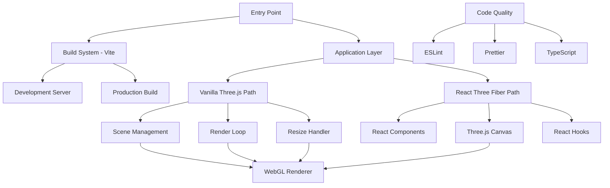

# Design Document

## Overview

The Three.js Starter System is designed as a minimal, production-ready foundation for 3D web applications. It provides two development approaches: vanilla Three.js with TypeScript modules and React Three Fiber for component-based development. The architecture emphasizes modularity, performance optimization, and developer experience through fast build tools and strict code quality enforcement.

## Architecture

### High-Level Architecture



### Project Structure

```
three-js-starter/
├── src/
│   ├── vanilla/                 # Vanilla Three.js implementation
│   │   ├── main.ts             # Entry point
│   │   ├── scene/              # Scene management modules
│   │   │   ├── renderer.ts     # WebGL renderer setup
│   │   │   ├── scene.ts        # Scene creation and lighting
│   │   │   └── camera.ts       # Camera configuration
│   │   ├── systems/            # Core systems
│   │   │   ├── render-loop.ts  # Animation loop management
│   │   │   └── resize-handler.ts # Responsive handling
│   │   └── utils/              # Utility functions
│   │       └── cleanup.ts      # Resource cleanup
│   ├── react/                  # React Three Fiber implementation
│   │   ├── App.tsx             # React app entry
│   │   ├── components/         # 3D React components
│   │   │   ├── Scene.tsx       # Main scene component
│   │   │   └── TorusKnot.tsx   # Example 3D object
│   │   └── hooks/              # Custom React hooks
│   │       └── useResize.ts    # Resize handling hook
│   └── shared/                 # Shared utilities
│       ├── types.ts            # TypeScript definitions
│       └── constants.ts        # Application constants
├── public/                     # Static assets
├── dist/                       # Build output
├── package.json               # Dependencies and scripts
├── vite.config.ts            # Vite configuration
├── tsconfig.json             # TypeScript configuration
├── eslint.config.js          # ESLint configuration
├── .prettierrc               # Prettier configuration
└── README.md                 # Documentation
```

## Components and Interfaces

### Core Interfaces

```typescript
// Scene Management Interfaces
interface RendererConfig {
  antialias: boolean;
  alpha: boolean;
  powerPreference: 'high-performance' | 'low-power' | 'default';
  maxPixelRatio: number;
}

interface SceneConfig {
  background: THREE.Color | null;
  fog: THREE.Fog | null;
  lighting: LightingConfig;
}

interface LightingConfig {
  ambient: {
    color: number;
    intensity: number;
  };
  directional: {
    color: number;
    intensity: number;
    position: [number, number, number];
  };
}

// System Interfaces
interface RenderLoopSystem {
  start(): void;
  stop(): void;
  dispose(): void;
}

interface ResizeHandlerSystem {
  observe(element: HTMLElement): void;
  disconnect(): void;
  dispose(): void;
}
```

### Vanilla Three.js Components

#### Renderer Module (`src/vanilla/scene/renderer.ts`)
- **Purpose**: Creates and configures WebGL renderer with optimal settings
- **Key Features**: 
  - Pixel ratio capping for mobile performance
  - WebGL context configuration
  - Canvas setup and DOM integration
- **Interface**: `makeRenderer(container: HTMLElement, config: RendererConfig): THREE.WebGLRenderer`

#### Scene Module (`src/vanilla/scene/scene.ts`)
- **Purpose**: Creates 3D scene with lighting and example objects
- **Key Features**:
  - Basic lighting setup (ambient + directional)
  - TorusKnot geometry as example
  - Material configuration
- **Interface**: `makeScene(config: SceneConfig): THREE.Scene`

#### Camera Module (`src/vanilla/scene/camera.ts`)
- **Purpose**: Configures perspective camera with responsive aspect ratio
- **Key Features**:
  - Perspective camera setup
  - Aspect ratio management
  - Position and target configuration
- **Interface**: `makeCamera(aspect: number): THREE.PerspectiveCamera`

#### Render Loop System (`src/vanilla/systems/render-loop.ts`)
- **Purpose**: Manages animation loop with performance optimizations
- **Key Features**:
  - RequestAnimationFrame management
  - Delta time clamping
  - Frame rate monitoring
  - HMR cleanup support
- **Interface**: Implements `RenderLoopSystem`

#### Resize Handler System (`src/vanilla/systems/resize-handler.ts`)
- **Purpose**: Handles viewport changes and device orientation
- **Key Features**:
  - ResizeObserver integration
  - Camera aspect ratio updates
  - Renderer size updates
  - Event listener management
- **Interface**: Implements `ResizeHandlerSystem`

### React Three Fiber Components

#### App Component (`src/react/App.tsx`)
- **Purpose**: Root React component with Canvas setup
- **Key Features**:
  - Canvas configuration
  - Scene composition
  - Error boundaries

#### Scene Component (`src/react/components/Scene.tsx`)
- **Purpose**: Declarative 3D scene using JSX
- **Key Features**:
  - Lighting components
  - Camera controls
  - Environment setup

#### TorusKnot Component (`src/react/components/TorusKnot.tsx`)
- **Purpose**: Example 3D object as React component
- **Key Features**:
  - Animated rotation
  - Material properties
  - Responsive scaling

## Data Models

### Configuration Models

```typescript
// Application Configuration
interface AppConfig {
  renderer: RendererConfig;
  scene: SceneConfig;
  camera: CameraConfig;
  performance: PerformanceConfig;
}

interface CameraConfig {
  fov: number;
  near: number;
  far: number;
  position: [number, number, number];
}

interface PerformanceConfig {
  maxPixelRatio: number;
  maxDeltaTime: number;
  targetFPS: number;
}
```

### State Management

```typescript
// Application State (for vanilla implementation)
interface AppState {
  renderer: THREE.WebGLRenderer | null;
  scene: THREE.Scene | null;
  camera: THREE.PerspectiveCamera | null;
  renderLoop: RenderLoopSystem | null;
  resizeHandler: ResizeHandlerSystem | null;
  isInitialized: boolean;
}
```

## Error Handling

### Error Categories

1. **WebGL Context Errors**
   - WebGL not supported
   - Context lost/restored
   - Shader compilation failures

2. **Resource Loading Errors**
   - Texture loading failures
   - Model loading errors
   - Asset not found

3. **Performance Errors**
   - Memory leaks
   - Frame rate drops
   - Resource exhaustion

### Error Handling Strategy

```typescript
// Error Handler Interface
interface ErrorHandler {
  handleWebGLError(error: WebGLError): void;
  handleResourceError(error: ResourceError): void;
  handlePerformanceError(error: PerformanceError): void;
}

// Error Recovery Mechanisms
class ErrorRecovery {
  static recoverWebGLContext(renderer: THREE.WebGLRenderer): boolean;
  static fallbackToLowerQuality(): void;
  static reportError(error: Error, context: string): void;
}
```

### Graceful Degradation

- Automatic pixel ratio reduction on performance issues
- Fallback to basic materials if advanced features fail
- Progressive enhancement based on device capabilities

## Testing Strategy

### Unit Testing

- **Scene Creation**: Test renderer, scene, and camera initialization
- **System Functionality**: Test render loop and resize handler behavior
- **Utility Functions**: Test cleanup and helper functions
- **React Components**: Test component rendering and props handling

### Integration Testing

- **Full Application Flow**: Test complete initialization and rendering pipeline
- **HMR Behavior**: Test hot module replacement and cleanup
- **Responsive Behavior**: Test resize handling and mobile optimization
- **Error Scenarios**: Test error handling and recovery mechanisms

### Performance Testing

- **Frame Rate Monitoring**: Ensure consistent 60fps on target devices
- **Memory Usage**: Monitor for memory leaks during development
- **Bundle Size**: Keep production bundle under reasonable limits
- **Mobile Performance**: Test on various mobile devices and orientations

### Testing Tools

- **Vitest**: Unit and integration testing framework
- **@testing-library/react**: React component testing (for R3F path)
- **Playwright**: End-to-end testing for browser compatibility
- **Bundle Analyzer**: Monitor build output size and dependencies

## Build and Development Configuration

### Vite Configuration

```typescript
// vite.config.ts structure
export default defineConfig({
  // Development server configuration
  server: {
    port: 3000,
    open: true,
    hmr: true
  },
  
  // Build optimization
  build: {
    target: 'es2020',
    sourcemap: true,
    rollupOptions: {
      output: {
        manualChunks: {
          'three': ['three'],
          'react': ['react', 'react-dom']
        }
      }
    }
  },
  
  // Plugin configuration
  plugins: [
    // TypeScript support
    // React support (conditional)
    // Asset handling
  ]
});
```

### TypeScript Configuration

- Strict mode enabled
- Path mapping for clean imports
- Separate configs for different entry points
- Build-time type checking

### Code Quality Configuration

- ESLint with TypeScript rules
- Prettier with consistent formatting
- Pre-commit hooks for quality enforcement
- Import sorting and organization rules

## Deployment Considerations

### Production Optimization

- Tree shaking for minimal bundle size
- Asset optimization and compression
- CDN-ready static asset handling
- Progressive loading strategies

### Browser Compatibility

- Modern browser support (ES2020+)
- WebGL feature detection
- Graceful fallbacks for unsupported features
- Mobile browser optimization

### Performance Monitoring

- Frame rate tracking
- Memory usage monitoring
- Bundle size analysis
- Core Web Vitals optimization